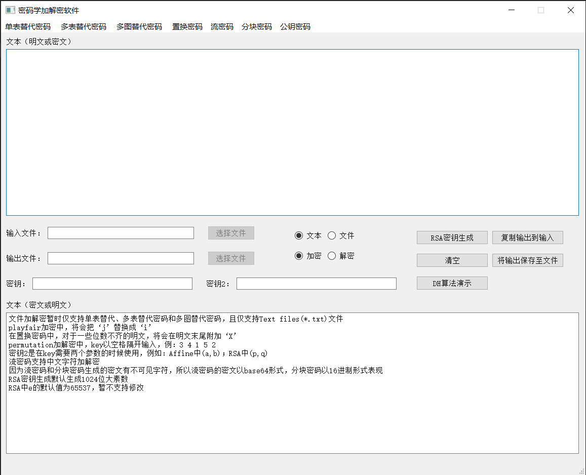

# Crypto-System

最近在实习，想可能会用到Github，先熟悉熟悉Github创建项目这些的，把之前做的一些东西放上来

这是我去年（2020）暑假的一个作业，也就是简单实现一些密码学的东西

利用Python+PyQt5完成的

主界面：

# 实现功能：

* 单表替代密码
  
  * 凯撒密码
  * Keyword密码
  * 仿射密码
  * Multiliteral密码

* 多表替代密码

  * Vigenere密码
  * Autokey Plaintext
  * Autokey Ciphertext

* 多图替代密码

  * Playfair密码

* 置换密码

  * Permutation密码
  * Column Permutation密码
  * Double Column Permutation密码

* 流密码

  * RC4

* 分块密码

  * DES

* 公钥密码

  * RSA
